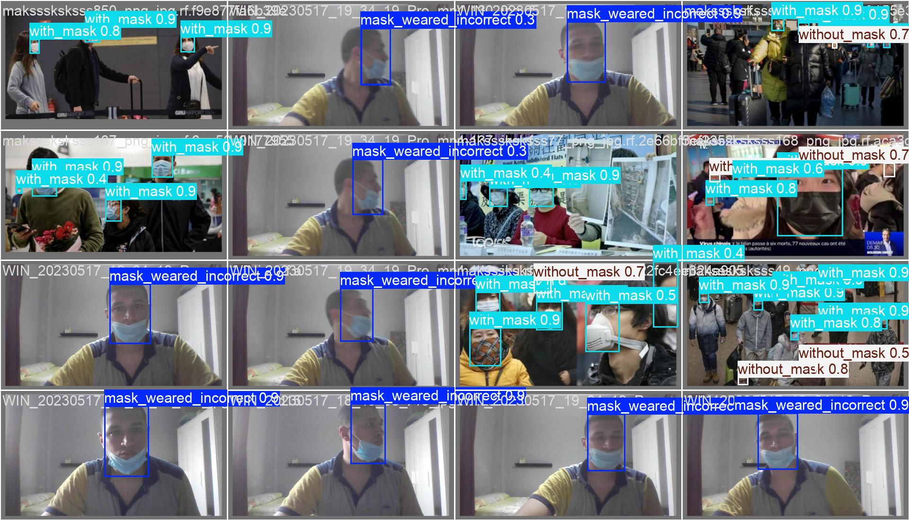
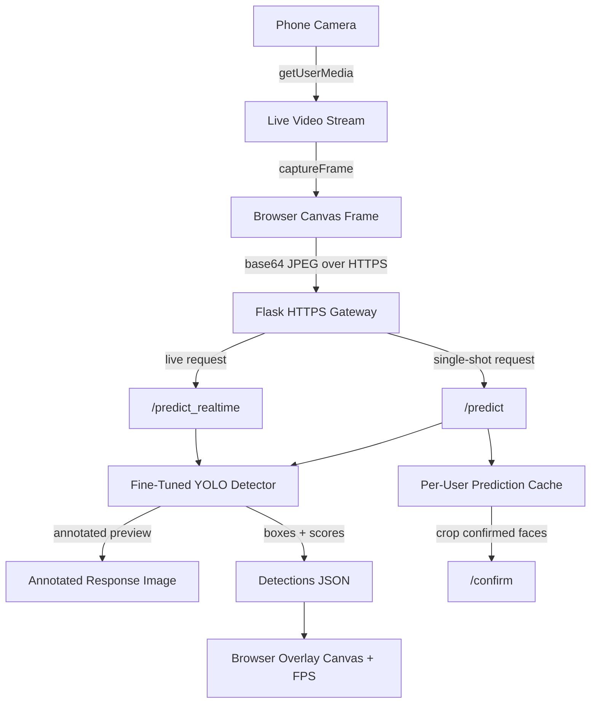
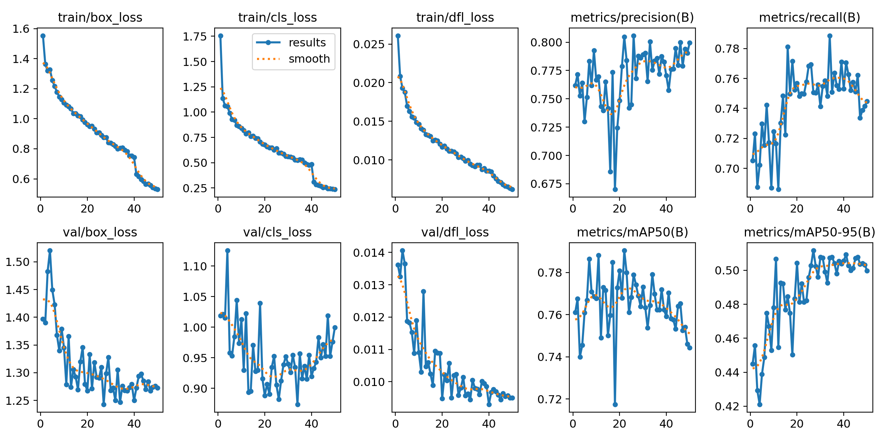
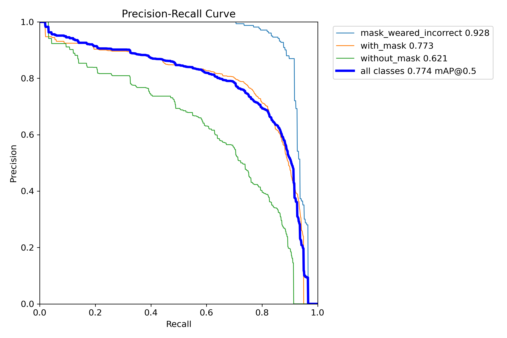
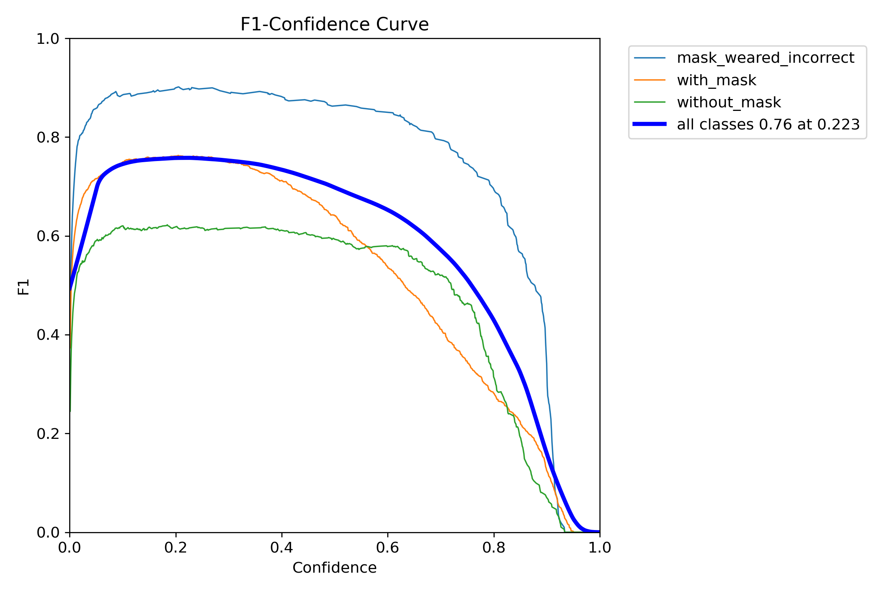
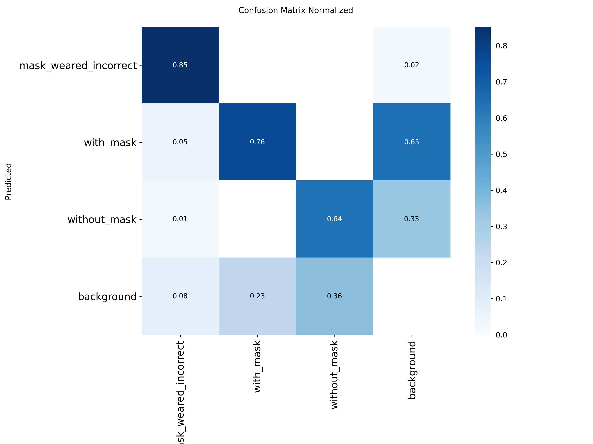

# Real-Time Face Mask Detection System

**English** | [中文](README_zh.md)

[](https://www.python.org/)
[](https://flask.palletsprojects.com/)
[](https://github.com/ultralytics/ultralytics)
[](https://opensource.org/licenses/MIT)

This project is a production-style computer vision prototype for **real-time face mask compliance monitoring** (mask on / no mask / incorrect mask). It combines a fine-tuned YOLO detector, a Flask inference backend, and a mobile-friendly browser frontend with live camera streaming, real-time overlay rendering, FPS tracking, and a fallback single-shot capture workflow.

## 1) Demo

Realtime detection demo (GIF):


Sample prediction image (JPG):



## 2) Highlights

- End-to-end CV delivery: model training, inference API, and web UI in one project.
- Dual inference mode: single-shot (`/predict`) and low-latency live mode (`/predict_realtime`).
- Mobile browser support via HTTPS (`ssl_context='adhoc'`) and `getUserMedia`.
- Real-time overlay pipeline with request backpressure control (`inFlight`).
- Defensive backend design: path anchoring, safe bounds clamp, and session cache checks.
- Clean artifact handling: in-memory image encoding (`cv2.imencode`) without temp files.

## 3) Tech Stack

- **Model / CV**: Ultralytics YOLO, OpenCV, NumPy, Pillow
- **Backend**: Python, Flask, Flask-CORS
- **Frontend**: HTML, CSS, Vanilla JavaScript, HTML5 Canvas, `getUserMedia`
- **Runtime**: HTTPS on local network for phone camera access
- **Packaging**: `requirements.txt` in `RMD/Server`

## 4) Architecture



## 5) Model and Training

### Dataset and Task

- Task: object detection with 3 classes:
  - `with_mask`
  - `without_mask`
  - `mask_weared_incorrect`
- Training run source: `mask_continue_from_yolo26m-3`
- Published training artifacts: [`assets/training/`](assets/training)

### Training Configuration (from `args.yaml`)

- Base model: `yolo26m.pt`
- Epochs: 50
- Input size: 640
- Batch size: 8
- IoU threshold (val/infer setting): 0.7
- Augmentation stack includes: mosaic, mixup, copy-paste, HSV, flip, RandAugment, erasing

### Key Metrics (from `results.csv`)

| Metric | Best Value | Epoch |
|---|---:|---:|
| Precision (B) | 0.806 | 26 |
| Recall (B) | 0.789 | 34 |
| mAP@0.5 (B) | 0.790 | 22 |
| mAP@0.5:0.95 (B) | 0.512 | 27 |

Final epoch (50): Precision `0.800`, Recall `0.745`, mAP@0.5 `0.744`, mAP@0.5:0.95 `0.500`.

### Training Curves

| Overview | PR Curve |
|---|---|
|  |  |
|  |  |

Additional artifacts: [Precision Curve](assets/training/BoxP_curve.png), [Recall Curve](assets/training/BoxR_curve.png), [Raw Confusion Matrix](assets/training/confusion_matrix.png), [Per-epoch Metrics CSV](assets/training/results.csv), [Training Args](assets/training/args.yaml).

## 6) Project Structure

```text
realtime-mask-detection/
├─ README.md
├─ README_zh.md
├─ assets/
│  └─ training/
│     ├─ results.png
│     ├─ BoxPR_curve.png
│     ├─ confusion_matrix_normalized.png
│     └─ results.csv
└─ RMD/
   ├─ Client/
   │  ├─ login.html
   │  ├─ upload.html
   │  └─ bcrlogo.png
   └─ Server/
      ├─ server.py
      ├─ requirements.txt
      └─ runs/
         ├─ yolo26mpro.pt
         └─ best.pt
```

## 7) Quick Start

### 1. Install dependencies

```bash
cd RMD/Server
pip install -r requirements.txt
```

### 2. Ensure weights are present

Required file:

```text
RMD/Server/runs/yolo26mpro.pt
```

### 3. Run server

```bash
python server.py
```

Server default:

- `https://127.0.0.1:5500`
- `https://<your-lan-ip>:5500`

### 4. Access from phone (same WiFi)

- Open `https://<your-lan-ip>:5500`
- Accept browser certificate warning (self-signed cert)
- Allow camera permission when prompted

## 8) API Reference

### `POST /predict`

Single-shot inference.

Request:

```json
{
  "image": "data:image/jpeg;base64,..."
}
```

Response:

```json
{
  "image_with_bboxes": "data:image/jpeg;base64,...",
  "summary": {"with_mask": 1, "without_mask": 0, "incorrect": 1},
  "count": 2
}
```

### `POST /predict_realtime`

Realtime lightweight inference (boxes only, no rendered image).

Request:

```json
{
  "image": "data:image/jpeg;base64,..."
}
```

Response:

```json
{
  "detections": [
    {
      "x": 201.4,
      "y": 143.2,
      "w": 92.8,
      "h": 109.4,
      "label": "with_mask",
      "category": "with_mask",
      "conf": 0.91
    }
  ],
  "summary": {"with_mask": 1, "without_mask": 0, "incorrect": 0},
  "count": 1,
  "img_w": 480,
  "img_h": 360
}
```

### `POST /confirm`

Crop faces from the last single-shot prediction cache.

Response:

```json
{
  "crops": [
    {
      "id": 0,
      "image": "data:image/jpeg;base64,...",
      "label": "without_mask",
      "category": "without_mask",
      "confidence": 0.88
    }
  ]
}
```

## 9) Engineering Highlights

- **Path anchoring**: model/static paths are resolved from `__file__`, not current working directory.
- **Safe cache access**: `/confirm` returns a controlled error when no prior `/predict` exists.
- **Boundary-safe cropping**: clamp coordinates to image dimensions.
- **No disk temp files**: crops encoded in memory via `cv2.imencode`.
- **Client backpressure control**: realtime loop only sends next frame after previous response.
- **Canvas dual-resolution strategy**: internal canvas size matches server frame for direct box mapping.
- **Lifecycle cleanup**: camera streams and live timers are stopped on logout/unload.
- **UX safety**: buttons disable during async operations to prevent duplicate requests.

## 10) Limitations

- Current account/session store is in-memory only (resets on server restart).
- Self-signed HTTPS (`adhoc`) is suitable for local demos, not production.
- CPU-only realtime speed can be limited (typically ~2-5 FPS depending on hardware).
- Current dataset scope is limited to 3 mask-wearing classes.
- No persistent database, audit logging, or RBAC yet.

## 11) Roadmap

- Add persistent storage (SQLite/PostgreSQL) for users and inference logs.
- Add Dockerized deployment and environment-based configs.
- Upgrade transport from polling to WebSocket streaming.
- Add model export benchmarks (ONNX / TensorRT) and GPU acceleration profile.
- Add automated evaluation script and CI checks for regression tracking.
- Add cloud-ready API gateway and observability metrics.

## 12) License

MIT (recommended for portfolio projects).  
Add a `LICENSE` file before publishing.
已使用 MIT 协议，详见 `LICENSE`。

## 13) Contact

Use this section on GitHub to add:

- Your name
- Email
- LinkedIn
- Portfolio / personal website

