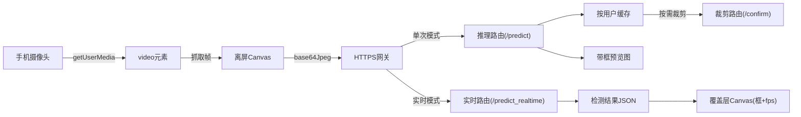

# 实时口罩检测系统

[English](README.md) | **中文**

[](https://www.python.org/)
[](https://flask.palletsprojects.com/)
[](https://github.com/ultralytics/ultralytics)
[](https://opensource.org/licenses/MIT)

这是一个面向求职展示的计算机视觉项目，目标是实现**实时口罩佩戴检测**（正确佩戴 / 未佩戴 / 错误佩戴）。项目包含完整工程链路：YOLO 模型训练、Flask 推理后端、移动端可用的浏览器前端、实时框渲染、FPS 统计，以及单帧拍照检测作为补充模式。

## 1）演示（Demo）

实时检测演示（GIF）：


示例预测图（JPG）：


## 2）项目亮点

- 端到端 CV 工程：训练、推理、前端交互全部落地在同一个项目里。
- 双模式推理：单次检测（`/predict`）+ 实时检测（`/predict_realtime`）。
- 支持手机浏览器：通过 HTTPS + `getUserMedia` 获取摄像头。
- 实时模式有请求节流（`inFlight`），避免前后端请求堆积。
- 后端具备防御式设计：路径锚定、边界裁剪、会话缓存检查。
- 裁剪图走内存编码（`cv2.imencode`），不产生临时垃圾文件。

## 3）技术栈

- **模型 / 视觉**：Ultralytics YOLO、OpenCV、NumPy、Pillow
- **后端**：Python、Flask、Flask-CORS
- **前端**：HTML、CSS、原生 JavaScript、HTML5 Canvas、`getUserMedia`
- **运行方式**：本地 HTTPS（手机访问摄像头必须）
- **依赖管理**：`BCR/Server/requirements.txt`

## 4）系统架构



## 5）模型与训练

### 数据与任务定义

- 检测任务：3 类口罩状态
  - `with_mask`
  - `without_mask`
  - `mask_weared_incorrect`
- 训练产物目录：`mask_continue_from_yolo26m-3`

### 训练配置（来自 `args.yaml`）

- 基础模型：`yolo26m.pt`
- 训练轮次：50
- 输入尺寸：640
- Batch size：8
- IoU 阈值（验证/推理设置）：0.7
- 数据增强：mosaic、mixup、copy-paste、HSV、随机翻转、RandAugment、erasing

### 关键指标（来自 `results.csv`）

| 指标 | 最优值 | Epoch |
|---|---:|---:|
| Precision (B) | 0.806 | 26 |
| Recall (B) | 0.789 | 34 |
| mAP@0.5 (B) | 0.790 | 22 |
| mAP@0.5:0.95 (B) | 0.512 | 27 |

最后一轮（epoch 50）：Precision `0.800`，Recall `0.745`，mAP@0.5 `0.744`，mAP@0.5:0.95 `0.500`。

### 训练曲线


## 6）项目结构

```text
Business-card-reader/
├─ README.md
├─ README_zh.md
└─ BCR/
   ├─ Client/
   │  ├─ login.html
   │  ├─ upload.html
   │  └─ bcrlogo.png
   └─ Server/
      ├─ server.py
      ├─ requirements.txt
      └─ runs/
         ├─ yolo26mpro.pt
         └─ best.pt
```

## 7）快速开始

### 1. 安装依赖

```bash
cd BCR/Server
pip install -r requirements.txt
```

### 2. 确认权重文件

必须存在：

```text
BCR/Server/runs/yolo26mpro.pt
```

### 3. 启动服务

```bash
python server.py
```

默认地址：

- `https://127.0.0.1:5500`
- `https://<你的局域网IP>:5500`

### 4. 手机访问（同一 WiFi）

- 打开 `https://<你的局域网IP>:5500`
- 接受浏览器的自签名证书警告
- 允许摄像头权限

## 8）API 说明

### `POST /predict`

单次检测接口。

请求体：

```json
{
  "image": "data:image/jpeg;base64,..."
}
```

返回体：

```json
{
  "image_with_bboxes": "data:image/jpeg;base64,...",
  "summary": {"with_mask": 1, "without_mask": 0, "incorrect": 1},
  "count": 2
}
```

### `POST /predict_realtime`

实时轻量接口（只返回框坐标，不返回渲染图）。

请求体：

```json
{
  "image": "data:image/jpeg;base64,..."
}
```

返回体：

```json
{
  "detections": [
    {
      "x": 201.4,
      "y": 143.2,
      "w": 92.8,
      "h": 109.4,
      "label": "with_mask",
      "category": "with_mask",
      "conf": 0.91
    }
  ],
  "summary": {"with_mask": 1, "without_mask": 0, "incorrect": 0},
  "count": 1,
  "img_w": 480,
  "img_h": 360
}
```

### `POST /confirm`

对最近一次单次检测结果进行裁剪返回。

返回体：

```json
{
  "crops": [
    {
      "id": 0,
      "image": "data:image/jpeg;base64,...",
      "label": "without_mask",
      "category": "without_mask",
      "confidence": 0.88
    }
  ]
}
```

## 9）工程实现亮点

- **路径锚定**：所有关键路径基于 `__file__` 计算，不依赖启动目录。
- **缓存安全访问**：`/confirm` 在无缓存时返回明确错误，不会 KeyError 崩溃。
- **边界裁剪保护**：坐标 clamp 到图像范围内，避免越界切片。
- **纯内存编码**：`cv2.imencode` 替代磁盘临时文件。
- **实时请求节流**：上一帧未返回时不发下一帧，避免请求堆积。
- **Canvas 双分辨率策略**：内部坐标与后端帧一致，框坐标无需额外换算。
- **生命周期清理**：退出页面/登出时主动关闭摄像头和实时循环。
- **交互防抖**：异步期间禁用按钮，防止重复点击。

## 10）当前限制

- 账号系统是内存态，服务重启后会清空。
- HTTPS 使用 `adhoc` 自签证书，仅适合本地演示。
- 纯 CPU 下实时帧率有限（通常约 2-5 FPS，视硬件而定）。
- 数据集类别目前仅覆盖 3 类口罩状态。
- 暂无持久化数据库、审计日志和权限分层。

## 11）后续规划

- 引入持久化存储（SQLite / PostgreSQL）记录用户与检测结果。
- 增加 Docker 部署与环境变量配置。
- 将实时轮询改为 WebSocket 流式传输。
- 增加 ONNX / TensorRT 导出与 GPU 加速对比。
- 增加自动化评估脚本与 CI 回归检测。
- 增加可观测性指标与云端部署入口。

## 12）开源协议

建议使用 MIT。  
发布到 GitHub 前请补一个 `LICENSE` 文件。
已使用 MIT 协议，详见 `LICENSE`。

## 13）联系方式

建议在该部分补充：

- 你的姓名
- 你的邮箱
- LinkedIn 链接
- 个人主页 / 作品集链接
